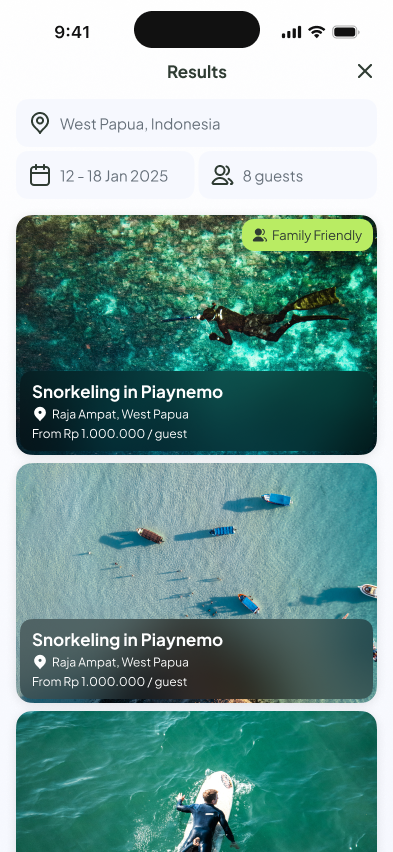

## Overview  
Coco.co is a snorkeling booking app, focusing on how we can simulating how we work on a real industry implementing clean architecture (MVVM+C) and spotting and cleaning dirty code.

## Tech Stack  
- Swift
- UIKit
- MapKit

## Visual Gallery  

## My Role  
- Tech Lead