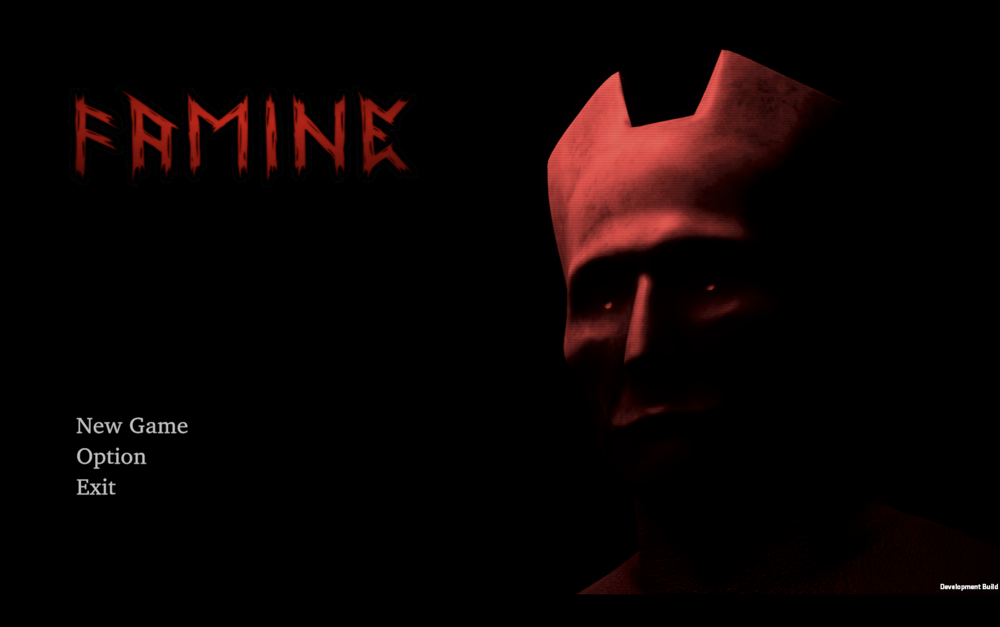
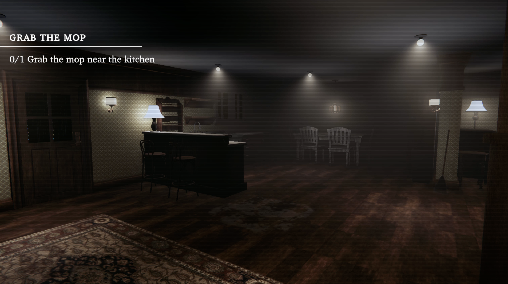

## Overview  
**Famine** is a psychological horror game built in Unity and published on the **Mac App Store**. The game follows a caretaker whose quiet job spirals into a nightmare as unsettling events begin to consume the home. What starts as a simple routine quickly turns into a fight for survival.

The project focuses on atmosphere, tension, and environmental storytelling — combining sound design, lighting, and minimal UI to create a slow-burn horror experience.

## Story Premise  
You play as a caretaker living with an elderly woman in a secluded rural house. Your task is straightforward: help her with daily chores.  
But the longer you stay, the stranger things become. Shadows shift, routines break, and something else begins to inhabit the home.  
You must uncover the truth, protect the woman, and escape before it’s too late.

## Tech Stack & Tools  
- **Unity Engine** (C#)  
- **URP** for lighting and rendering  
- **Custom shaders & post-processing** for atmospheric visuals  
- **Fmod / Unity Audio** for dynamic soundscapes  

## Key Features  
- 🎧 **Heavy atmosphere and psychological tension**  
- 👵 **Character-driven experience centered around an elderly woman**  
- 🔦 **Lighting-based horror cues**  
- 🎮 **Minimal UI and immersive storytelling**  
- 🍎 **Published on the Mac App Store**

## Visual Gallery  
  
  

## My Contribution  
- Lighting, atmosphere, and environment design  
- UI/UX for menu and in-game prompts  
- Build, optimization, and Mac App Store submission  

## Live on App Store  
[Download Famine on the Mac App Store](https://apps.apple.com/id/app/famine/id6755907745?mt=12)
