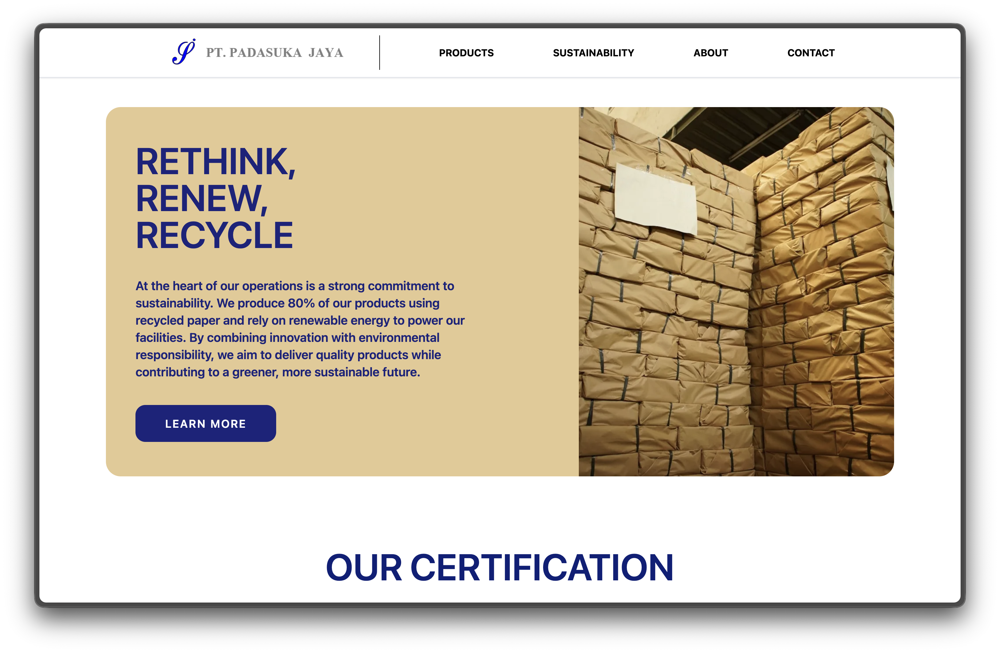

## Overview  
The Padasukajaya website is a clean product-focused site. I didn’t directly build this one — instead, I acted as a mentor. I guided the developer through structuring the pages, improving responsiveness, and making sure the UI stayed consistent across devices.

## Tech Stack  
- Astro + TailwindCSS  
- Optimized static layout  

## Visual Gallery  
  

## What I Helped With  
- Provided direction for layout and page structure  
- Gave feedback on responsive design  
- Helped refine UI consistency and image optimization  

## Live Website  
[Visit Padasukajaya](https://padasukajaya.id/)
