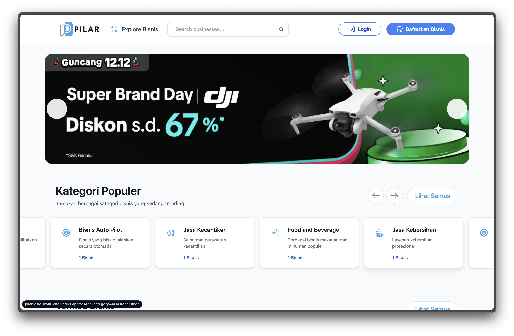
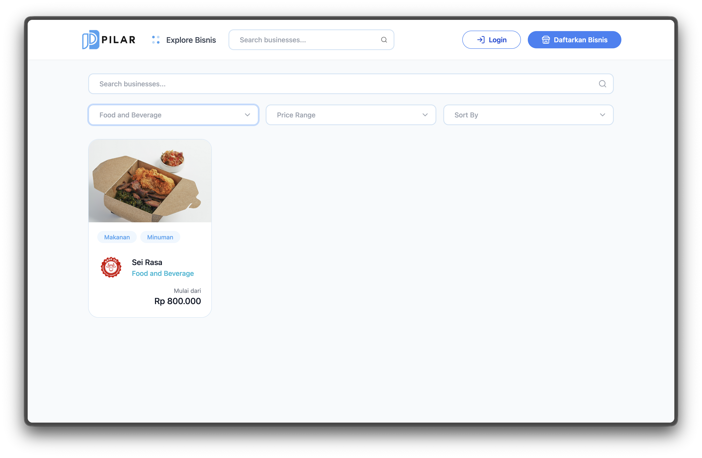

## Overview  
Pilarasia needed a modern business-oriented website with a clean front-end experience. I handled the UI layout and styling, making sure every section looked sharp, easy to navigate, and responsive across devices.

## Tech Stack  
- Astro / React + TailwindCSS  
- Fully responsive and clean layout  

## Visual Gallery  
  
  

## What I Worked On  
- Front-end layout and structure  
- Modern business-style UI  
- Ensured responsiveness across all screen sizes  

## Live Website  
[Visit Pilarasia](https://pilar-asia-front-end.vercel.app/)
